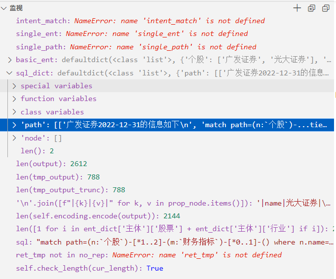
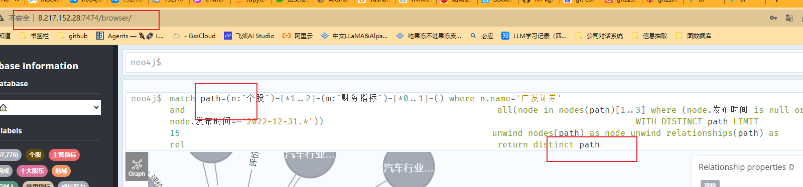
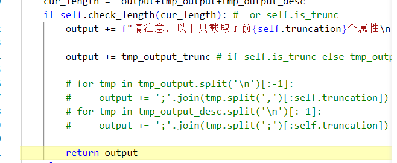

1. 使用线程控制查询超时，这部分主要是无结果的路径查找，该方法和直接使用第三方库做函数装饰器，效果相同，但都无法解决，一个线程持续查询，得等到主程序结束，才销毁的问题
   - 可能得寻求Neo4j的配置，限制查询时间
        def run_query(query, queue, stop_event):
            result = self.g.run(query)
            try:
                result = self.g.run(query)
            except Exception as e:
                print("查询出错:", e)
                stop_event.set()  # 设置停止事件
            finally:
                pass

            queue.put(result)

        def get_res(sql):
            result_queue = Queue()
            # 创建停止事件对象
            stop_event = threading.Event()
            thread = threading.Thread(target=run_query, args=(sql, result_queue, stop_event))
            thread.setDaemon(True) # 将线程设置为守护线程，当主线程终止时，守护线程也会被强制终止。
            
            thread.start() # 启动线程
            timeout_seconds = 5 # 设置查询超时时间（以秒为单位）
            thread.join(timeout_seconds) # 等待线程执行完毕或超时
            if thread.is_alive(): # 判断线程是否仍在运行
                print("查询超时")
                stop_event.set() 
                # thread.join()
                res = None
            else:
                res = result_queue.get()
            return res

        @timeout_decorator.timeout(5)
        def test(query):
            try:
                result = self.g.run(query)
                return result
            except Exception as e:
                print("查询出错:", e)
                return None
            finally:
                pass

- 删除索引
1. 先找到索引名 SHOW RANGE INDEXES WHERE owningConstraint IS NULL
2. drop index 索引名

# 当前结果
- 目前在30个问题上的查询速度和返回字符数，作为测试对比  

# 出现查询问题怎么解决：
1. 给定不能回答的问题格式
   在`KBQA/answer_searcher.py`中的main下，定义
   >ent_dict = {'主体': {'股票': ['广发证券', '光大证券'], '行业': ['']}, '发布时间': ['2022年', '2023年'], 'intent': ['财务指标']} \

   可以在debug下 查看返回的查询语句，其中断点打在 sql解析处(`400行`)和返回回答处(`return output`)
   
    有两类返回的sql，然后在neo4j浏览器中进行查询，看看返回了哪些路径节点
   
2. 如果查询语句里头没有想要的东西，说明查询出问题，需要在`KBQA/question_parser.py`中看看是哪除了问题，是sql的条件太多，还是路径方向找的不对，现在基本不会有查询超时的原因
3. 如果是有东西的sql，但返回的内容给`output`，超长度了，即会运行到下面的函数，考虑如何过滤查询语句，把没用的sql不要了
   
4. 修改后的完备性检查
   先看看修改后能不能查到想要的内容，可以了的话，把`KBQA/answer_searcher.py`中的main下已经有的32条测试问题，测一遍，比对下上面那个没改之前的运行结果
   

## 目前已知的问题
- 找股票的评价 查询失败
- 查2个股 2年份财务指标 因为超token了， 查询截断了一个个股的一个年份
