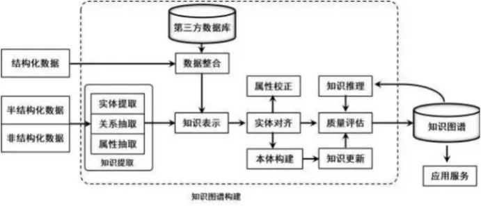
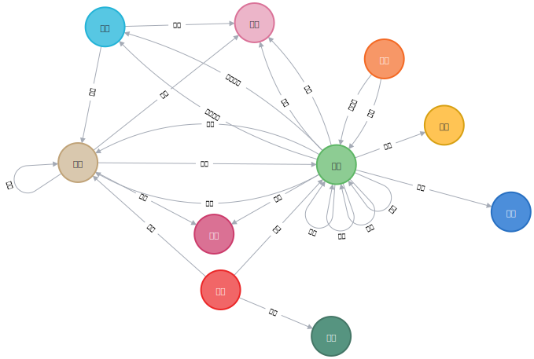

# KG 构建 pipeline
1. 基于金融领域的Schema创建基础图谱
2. 基于抽取模型得到实体类型、属性/关系三元组
   - CCKS 2020:基于本体的金融知识图谱自动化构建评价 Baseline： https://github.com/wgwang/ccks2020-baseline/blob/master/ccks2020-baseline.ipynb。 针对现成抽取算法（抽取通用实体类型）+规则抽取（特定实体类型）生成一定规模的实体标注数据集并进行迭代式的模型训练，具体包括以下步骤：
      1. 语料的句子切分
      2. 匹配句子与 'FR2KG/seedKG/entities.json'中的初始的**总实体集合**，若句子中存在实体则加入到标注数据集中
      3. 微调Bert+CRF模型用于实体标注任务，
      4. 将模型预测的实体结果无重复的加入到**总实体集合**中，重复2、3，最终得到**总实体集合**
      5. 关系抽取：将**总实体集合**与语料句子匹配得到当前句子中出现的**样本实体集合**，根据'FR2KG/schema.json'指定的关系三元组，若头尾实体类型相同，根据顺序构建头尾；否则，直接查询一行文本段落出现的头尾实体，组成对应的三元组
      6. 属性抽取：针对'FR2KG/schema.json'中有属性的实体类型，对出现实体的语料段落，根据规则寻找属性

3. 图谱融合扩充
   1. 实体对齐（链接、消歧）\
        例如小米、小米公司、小米集团、小米手机、小米手表等都将被归为小米实体，存在以下实体和关系三元组 
        >实体：(机构，小米) (产品，小米手机) (产品，小米手表) \
        属性三元组：(小米，别名，小米公司) \
        关系三元组：

        消歧：针对出现的实体“小米”，需要判断是“小米手机”还是“小米公司”，需根据上下文进行消歧 \
        链接：将文本中的实体链接到知识库中的相应实体，针对文本“”

4. 图谱更新

# 可能存在的问题
1. 研报的发布时间，可能存在信息滞后带来的部分属性偏差，需要及时准确的图谱更新
2. 

# 金融KG Schema说明

实体说明：
1. 研报：指研报本身，用研报的标题来表示
2. 指标：各类研报常用的金融指标，比如roe、eps、毛利率等
3. 人物：就是通常的人物
4. 机构：公司、企业、政府等都属于机构类型的实体
5. 产品：一般指公司生产的可以买卖的物品，也包括软件类产品。对于软件类等虚拟的产品来说，一般在交易的过程中会有**产权的转移**。
   - 存在属性“产权是否转移”
6. 业务：一般指服务类的业务，一般来说服务类的业务在进行交易的时候，**产权没有发生转移**。
   - 存在属性“产权是否转移”
7. 风险：研报中的风险提示
8. 文章：研报中引用的各类政策、报告、论文等文章
9. 行业：公司所隶属的行业
10. 品牌：公司所拥有的品牌，部分公司的品牌名和公司名会有重叠的，需要根据上下文识别出具体指代的是品牌还是公司本身。
>补充关系 股票

关系：
- seed关系类别三元组数19，关系数：6091
- 补充关系：(机构，发布，研报) (股票, 属于, 行业)

# 当前存在的问题
- 基础图谱构建完成，但发现关系数多了20条，且schema也多了一些（cypher查询不到的类别三元组）